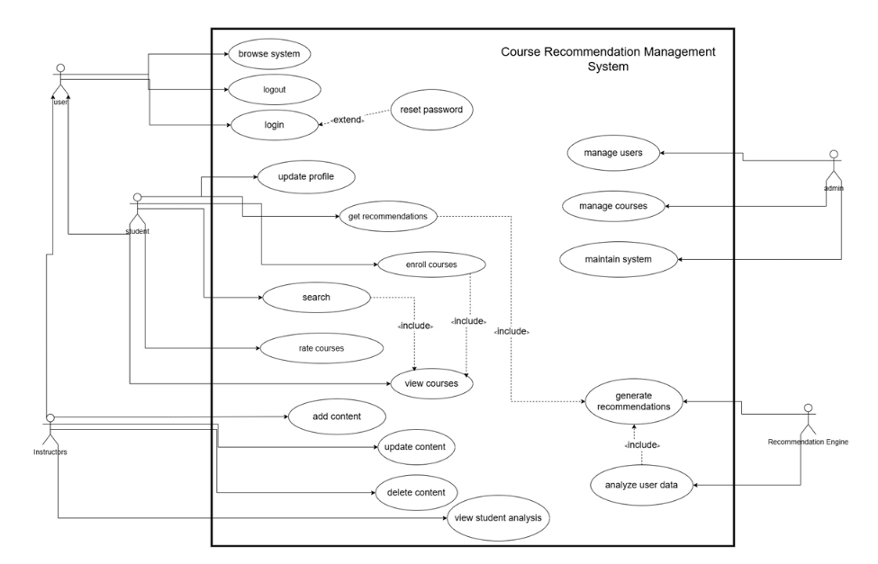
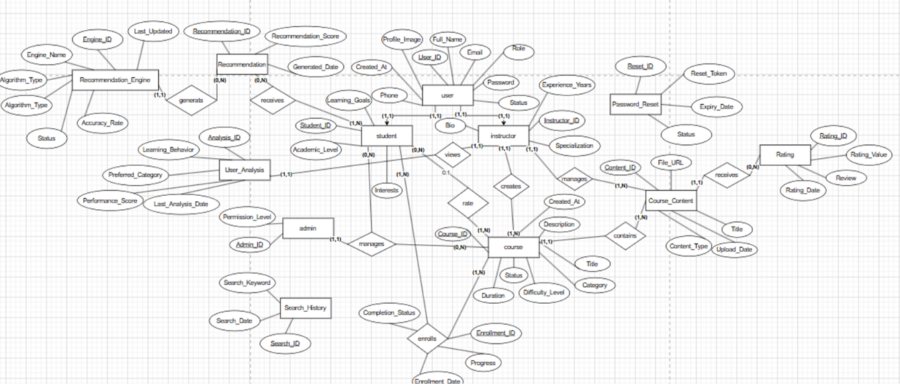
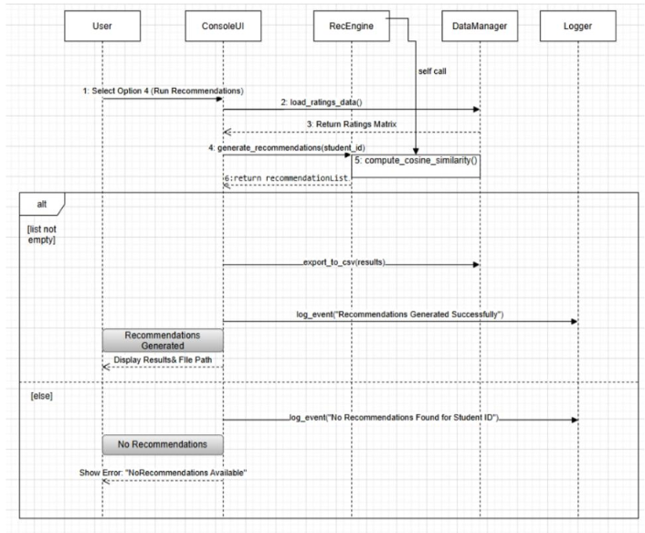

# 🎓 Student Course Recommendation & Management System (SCRMS)

<div align="center">

[](https://github.com/)
[](https://github.com/)
[](https://github.com/)

</div>

---

## 🚀 Overview & Project Vision

The **Student Course Recommendation & Management System (SCRMS)** is an enterprise-grade academic platform engineered to streamline university course registration and eliminate traditional advising bottlenecks. 

By bridging rigorous **Software Requirements Engineering (SRS)** with a **Collaborative Filtering AI Engine**, the system shifts academic planning from static, error-prone manual scheduling to a proactive, data-driven, and personalized student experience.

### Why This System Matters (The Value Proposition):
* **For Students:** Eliminates guesswork in elective course selection through algorithmic recommendations based on historical peer performance and preference alignment.
* **For Administrators:** Provides a bulletproof, decoupled data-management backbone ensuring transactional integrity, strict validation rules, and automated audit trails.
* **For Engineering Standards:** Exemplifies full-lifecycle software development—from abstract use-case elicitation and UML modeling to clean code architecture and matrix-based recommendation logic.

---

## 🛠️ Core Engineering Keywords & Competencies Demonstrated

> *This repository highlights proficiency in the following industry-standard concepts and technical stacks:*
* **Software Engineering & Modeling:** Requirements Elicitation, SRS Documentation, Use Case Modeling, Behavioral & Structural UML Design.
* **System Architecture:** 3-Tier Layered Architecture (Presentation Layer, Business Logic Layer, Data Access Layer), Separation of Concerns (SoC), Modular Design.
* **Data Engineering & Persistence:** Relational Database Mapping, Entity-Relationship Modeling (ERD), Normalized Schema Design, Safe File I/O Management.
* **Artificial Intelligence & Data Analysis:** Collaborative Filtering, Cosine Similarity, Vector Space Modeling, Threshold Confidence Filtering, Recommendation Systems.
* **Quality Assurance & Verification:** Test Traceability Matrices, Boundary Value Analysis, Cascade Deletion Integrity, Exception Handling.

---

## 📊 System Architecture & Visual Models

The architecture of SCRMS is fully mapped through a comprehensive set of Unified Modeling Language (UML) diagrams and data structures located in the [`docs/diagrams/`](docs/diagrams/) directory.

### 1. High-Level Use Case Model
The Use Case Diagram defines the behavioral boundaries, actors (`Student`, `Admin`, `System`), and the core functional interactions within the platform.
<p align="center">
  
</p>

### 2. Entity-Relationship (ERD) & Relational Mapping
The data model enforces strict relational constraints across core academic entities, ensuring zero data anomalies during cascading updates or deletions.
<p align="center">
  
</p>

### 3. Behavioral Dynamics (Activity & Sequence Flows)
The system logic is governed by strict execution workflows, mapping out step-by-step user interactions and asynchronous data validation.
<p align="center">
  
</p>

---

## ⚙️ Functional Modules Breakdown

1. **Administrative Control Hub:**
   * Full CRUD operations for Students and Courses with regex-based data sanitization.
   * Multi-character destructive action confirmations (`YES` prompts) to safeguard against accidental deletions.
   * Automatic cascading updates for dependent relations (e.g., clearing associated ratings upon course removal).

2. **AI Recommendation Pipeline:**
   * Constructs dynamic user-item interaction matrices from historical student ratings.
   * Computes **Cosine Similarity** coefficients to map preference proximities between users and academic tracks.
   * Enforces confidence thresholds ($\ge 20\%$) and excludes already-completed courses to maximize recommendation relevance.

3. **Audit & Safety Architecture:**
   * Implements an immutable, append-only operation log (`system_operations.log`) tracking system states, administrative overrides, and error traces.

---

## 📂 Repository Structure

```text
📦 student-course-recommendation-system
 ┣ 📂 docs
 ┃  ┣ 📜 SRS_Report.pdf
 ┃  ┗ 📂 diagrams
 ┃     ┣ 🖼️ activity_diagram.png
 ┃     ┣ 🖼️ class_diagram.png
 ┃     ┣ 🖼️ object_diagram_1.png
 ┃     ┣ 🖼️ object_diagram_2.png
 ┃     ┣ 🖼️ sequence_diagram.png
 ┃     ┣ 🖼️ use_case.png
 ┃     ┗ 🖼️ er_diagram.png
 ┗ 📂 code
    ┗ 📂 ai and soft (gui edition)
       ┗ 📂 ai and soft
          ┗ 📂 main project 3 (the highest priority now)
             ┣ 📂 data
             ┣ 📂 data_access
             ┣ 📂 logic
             ┣ 📂 models
             ┣ 📂 ui
             ┣ 📜 admin_cfg.txt
             ┣ 📜 admin_cred.txt
             ┣ 📜 data_generator.py
             ┣ 📜 debug_data.py
             ┣ 📜 main.py
             ┣ 📜 process_student_data.py
             ┣ 📜 test_recommendations.py
             ┗ 📜 train_model.py
